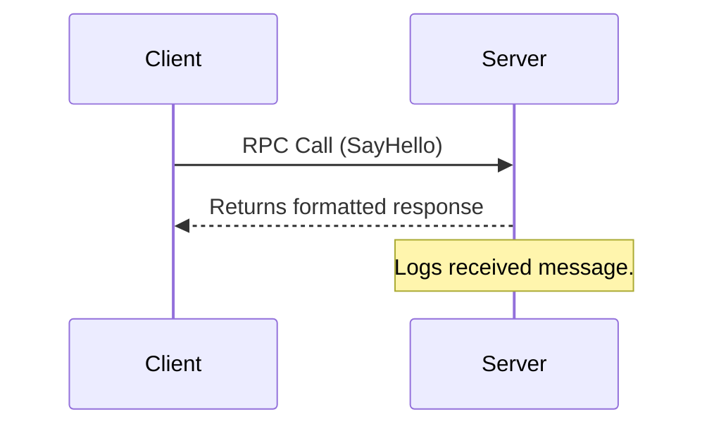

# 💬 Go RPC Chatroom

A lightweight and educational **chatroom system** implemented in **Go**, using the built-in [`net/rpc`](https://pkg.go.dev/net/rpc) package.  
This project demonstrates the fundamentals of **Remote Procedure Call (RPC)** communication between clients and a coordinating server in a simple, extensible architecture.
[Click here to watch the demo](https://drive.google.com/file/d/1yUv_1bDV8xCLuo_BWalsgf0xrqNhVCYh/view?usp=drive_link)


---

## 🧠 Overview

This project consists of two main components:

| File | Description |
|------|--------------|
| `server.go` | Hosts the RPC service (`HelloService`) and handles incoming client connections. |
| `client.go` | Connects to the RPC server, sends messages, and displays server responses. |

Clients communicate with the server through TCP using a remote method call to exchange messages, forming the foundation for a distributed chatroom.

---

## ⚙️ Features

- 🛰️ **RPC-based Communication** — Simple request/response model using Go’s `net/rpc` package.  
- 💬 **Interactive Messaging** — Clients can send messages (or names) and receive dynamic replies.  
- 🔄 **Concurrent Connections** — The server can handle multiple clients concurrently using goroutines.  
- 🔧 **Extensible Design** — Easy to expand into a full multi-user chat application with message broadcasting or persistence.

---

## 🏗️ Architecture




## ⚙️ How to Run

### 1️⃣ Start the Server
```bash
go run server.go
```
You should see:
```
💬 Chat server running on port 1234...
Type 'exit' to stop the server or 'clear' to clear the chat history.
```

### 2️⃣ Start a Client
In a new terminal window:
```bash
go run client.go
```
Then enter your name and start chatting 💬

You can open **multiple clients** to simulate multiple users.

---

## 🧠 How It Works

- The **server** keeps track of all messages in memory.  
- Each **client** connects via RPC and sends `ChatMessage` structs to the server.  
- The server appends messages to the chat history and returns the updated history to all connected clients.

---


